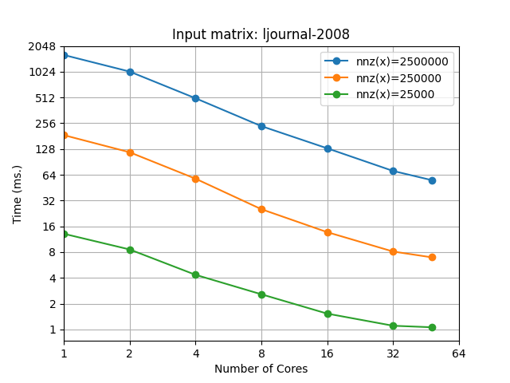
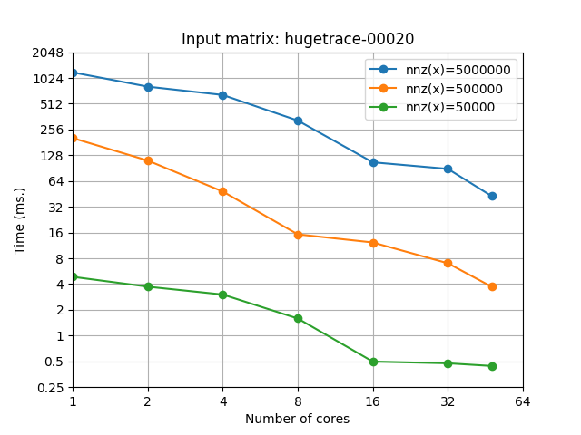

# pla-kernels
A collection of high-performance parallel linear algebra kernels for shared-memory multiprocessors. These kernels are implemented in C++ and rely on OpenMP for parallelization.

## Kernels
### SpMSpV
#### Description
Sparse matrix-sparse vector (SpMSpV) multiplication of the form y = Ax is a widely used computational kernel with many applications in machine learning and graph analytics. A sparse input matrix A is multiplied by a sparse input vector x to produce a sparse output vector y.

**src/spmspv/** implements the **SpMSpV-bucket** algorithm that was recently proposed by Azad and Buluc [[1]](#1). Unlike most prior approaches, this algorithm achieves *work-efficiency*, which means that the total work performed by all processors remains within a constant factor of the fastest known serial algorithm.

#### Experimental Evaluation
To assess the performance and strong scaling of our SpMSpV-bucket implementation, we measure its runtime on several representative matrix inputs taken from the University of Florida sparse matrix collection [[2]](#2). In each experiment, we multiply the input matrix A by a randomly generated sparse input vector x, varying the degree of sparsity in x and the number of threads.

##### Results on ljournal-2008 
ljournal-2008 is an adjacency matrix of the LiveJournal social network containing approximately 5.36M vertices and 79M edges. We multiply the input matrix by a sparse vector with 25K, 250K, and 2.5M nonzero values and report the runtime (averaged over 1000 iterations) as a function of thread count.

##### Results on hugetrace-00020
hugetrace-00020 is a high-diameter graph representing frames from a two-dimensional adaptive numerical simulation. It contains approximately 16M vertices and 24M edges. We use the same methodology as above and report the average SpMSpV runtime as a function of thread count for several input vector sparsity patterns.

 

##### Evaluation platform
Our measurements were conducted on a dual-socket 2.9GHz Intel Cascade Lake Xeon server with 24 cores per socket and 35.75MB of L3 cache. Peak memory bandwidth (as reported by <a href="https://www.intel.com/content/www/us/en/developer/articles/tool/intelr-memory-latency-checker.html">mlc</a>) is 80GB/s per node.

## References
<a id="1">[1]</a> 
Ariful Azad, Aydin Buluc.
*A Work-Efficient Parallel Sparse Matrix-Sparse Vector Multiplication Algorithm.*
IPDPS 2017, pp. 688-697.

<a id="2">[2]</a> 
Timothy A. Davis, Yifan Hu.
*The University of Florida Sparse Matrix Collection.*
ACM Trans. Math. Softw., Vol. 38, No. 1, pp. 1-25.
